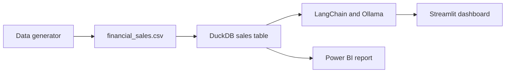

# GenAI SQL Analytics and Financial Reporting

An end-to-end Generative BI application for exploring financial sales data with natural language. The project combines synthetic data generation, DuckDB analytics, LangChain text-to-SQL, Ollama, a Streamlit dashboard, and a Power BI report.

## Features

- KPI tracking for revenue, profit margin, operating cost, and transactions.
- Region and department filters.
- Monthly financial performance visualizations.
- Natural-language questions converted into read-only DuckDB SQL.
- CFO-style executive narrative generation.
- Revenue anomaly detection using z-scores.
- Power BI workbook included in `dashboard/`.
- High-resiliency SQL execution with up to two dedicated repair attempts.

## Technology Stack

| Area | Technology |
| --- | --- |
| Application | Python, Streamlit |
| LLM integration | LangChain, Ollama |
| Default model | `qwen2.5:1.5b` |
| Database | DuckDB |
| Data processing | Pandas, NumPy, SciPy |
| Visualization | Plotly |
| BI report | Power BI (`.pbix`) |

## Repository Structure

```text
.
├── .github/workflows/refresh-data.yml
├── dashboard/financial_kpis.pbix
├── data/generate_data.py
├── src/app.py
├── src/database.py
├── src/narrator.py
├── src/pipeline.py
├── tests/test_pipeline.py
├── Dockerfile
├── render.yaml
├── start.sh
├── requirements.txt
└── README.md
```

## Prerequisites

- Python 3.10 or newer
- Ollama installed and running for local use
- Enough memory for the selected model

The default model is intentionally small for machines with approximately 6-8 GB RAM. Larger models such as `llama3` may fail to load on low-memory systems.

## Local Setup

From the project root on Windows:

```bat
python -m venv venv
venv\Scripts\activate
pip install -r requirements.txt
ollama pull qwen2.5:1.5b
```

Generate or refresh the 2,500-record dataset:

```bat
venv\Scripts\python.exe data\generate_data.py
```

Run the dashboard:

```bat
streamlit run src\app.py
```

Open the local URL shown by Streamlit, normally `http://localhost:8506`.

The dashboard loads the CSV into a private in-memory DuckDB connection, so multiple browser sessions do not compete for a file lock.

## Model Configuration

The application reads `OLLAMA_MODEL` and defaults to `qwen2.5:1.5b`.

Command Prompt:

```bat
set OLLAMA_MODEL=qwen2.5:1.5b
streamlit run src\app.py
```

PowerShell:

```powershell
$env:OLLAMA_MODEL = "qwen2.5:1.5b"
streamlit run src\app.py
```

The selected model must already be installed with `ollama pull <model-name>`.

## Example Questions

- `What are the top 3 regions by net revenue and total profit margin?`
- `Which product generated the most revenue?`
- `Show operating cost by department.`
- `What is the monthly net revenue trend?`

## Data Flow



## SQL Safety

The Text-to-SQL pipeline validates generated SQL before execution. It permits one `SELECT` or read-only `WITH` query and rejects:

- `INSERT`, `UPDATE`, `DELETE`, and other write statements
- DDL and administrative statements such as `DROP`, `ALTER`, `COPY`, and `INSTALL`
- Multiple SQL statements in one response
- User prompts longer than 1,000 characters

For production use, also add authentication, rate limiting, read-only credentials, and monitoring.

## Recommendation Coverage

| Recommendation | Implementation |
| --- | --- |
| Data ingestion | `data/generate_data.py` creates 2,500 records, calculates margins, and injects 15 revenue anomalies. |
| Text-to-SQL | LangChain prompt-to-Ollama execution chain generates DuckDB SQL. |
| Analytics | DuckDB supports grouped reporting, KPI calculations, trend analysis, and anomaly detection. |
| User interface | Streamlit provides four tabs with filters, Plotly charts, SQL results, and CFO summaries. |
| Error resiliency | `src/pipeline.py` retries failed SQL with a dedicated repair chain up to two times. |

## Resume Pitch

Built an end-to-end GenAI financial analytics platform that synthesizes 2,500 transactional records, converts natural-language questions into safe DuckDB SQL, provides interactive Streamlit and Plotly reporting, generates CFO summaries, detects revenue anomalies, and repairs failed SQL queries through two controlled LLM retries.

## Scheduled Data Refresh

`.github/workflows/refresh-data.yml` runs the data generator weekly and on demand. It uploads the generated CSV as a GitHub Actions artifact instead of committing generated data to the repository.

## Deploy to Render

The repository includes `Dockerfile`, `start.sh`, and `render.yaml` for a Docker-based Render deployment. The container starts Ollama, downloads `qwen2.5:1.5b`, generates the dataset, and starts Streamlit on Render's `PORT`.

1. Push the latest commit to GitHub.
2. In Render, choose **New > Blueprint**.
3. Select this repository and confirm `render.yaml`.
4. Use a plan with at least 2 GB RAM for this Ollama configuration.
5. Open the generated Render URL after the build completes.

Streamlit Community Cloud cannot run a local Ollama process by default. Use a hosted LLM provider there or deploy Ollama alongside the app on Render or AWS EC2.

## GitHub Commands

The remote is already configured for this project. To synchronize local changes safely:

```bat
git add .
git commit -m "describe your change"
git pull --rebase origin main
git push origin main
```

## Portfolio Checklist

- Add real dashboard screenshots under an `assets/` directory before linking them in this README.
- Record a short demo showing a natural-language question, generated SQL, results, and the Power BI report.
- Describe measured query accuracy only when backed by a repeatable evaluation set.

## Developer

- **Developer:** Devvrat Welekar
- **GitHub:** [github.com/devvratwelekar](https://github.com/devvratwelekar)
- **LinkedIn:** [Devvrat Welekar Profile](https://www.linkedin.com/in/devvrat-welekar/)
