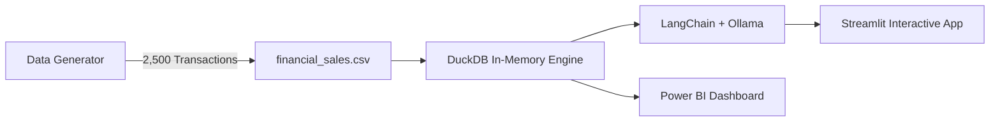

<div align="center">

# 💸 GenAI SQL Analytics & Financial Reporting

**An end-to-end Generative BI dashboard powered by DuckDB, LangChain, and Ollama**


</div>

--

## 📌 Overview

This project transforms natural language questions into executable read-only DuckDB SQL queries to explore financial sales data. It features real-time Streamlit visual analytics, automated CFO narrative generation, z-score anomaly detection, an integrated Power BI report, and self-repairing SQL retry chains.

--

## ✨ Key Features

- **Text-to-SQL Interface:** Converts plain English prompts into optimized DuckDB queries using LangChain and local LLMs (`qwen2.5:1.5b`).
- **Self-Healing SQL Execution:** Automatically detects failed query syntax and attempts up to 2 LLM repair retries.
- **Interactive BI Dashboard:** Tracks KPI metrics (Revenue, Profit Margin, Operating Costs) with dynamic filtering.
- **CFO Executive Summaries:** Generates automated narrative summaries for rapid decision-making.
- **Anomaly Detection:** Identifies revenue outliers using Z-score statistics.
- **Read-Only SQL Sandbox:** Blocks `INSERT`, `UPDATE`, `DELETE`, and DDL statements for database safety.

---

## 🛠️ Technology Stack

| Domain | Technology |
| :--- | :--- |
| **Application & UI** | Python 3.10+, Streamlit |
| **LLM & Agents** | LangChain, Ollama (`qwen2.5:1.5b`) |
| **Analytics Engine** | DuckDB (In-Memory) |
| **Data Processing** | Pandas, NumPy, SciPy |
| **Visualizations** | Plotly |
| **BI Reporting** | Microsoft Power BI (`.pbix`) |
| **Deployment** | Docker, Render, GitHub Actions |

---

## 🔄 System Architecture



---

## ⚡ Quick Start (Local Setup)

### Prerequisites

* **Python 3.10+**
* **Ollama** installed and running (`ollama pull qwen2.5:1.5b`)

### Installation & Run

```bash
# 1. Clone the repository
git clone [https://github.com/DevvratWelekar/GenAI-SQL-Analytics-and-Financial-Reporting.git](https://github.com/DevvratWelekar/GenAI-SQL-Analytics-and-Financial-Reporting.git)
cd GenAI-SQL-Analytics-and-Financial-Reporting

# 2. Create and activate virtual environment
python -m venv venv
# On Windows:
venv\Scripts\activate
# On Linux/macOS:
source venv/bin/activate

# 3. Install dependencies & pull LLM model
pip install -r requirements.txt
ollama pull qwen2.5:1.5b

# 4. Generate 2,500 sample dataset records
python data/generate_data.py

# 5. Launch the dashboard
streamlit run src/app.py

```

---

## 📁 Repository Structure

```text
├── .github/workflows/     # Automated weekly dataset refresh pipeline
├── dashboard/             # Power BI report files (.pbix)
├── data/                  # Synthetic dataset generator scripts
├── src/                   # Core application logic
│   ├── app.py             # Streamlit user interface
│   ├── database.py        # DuckDB connections & query execution
│   ├── narrator.py        # CFO narrative generation engine
│   └── pipeline.py        # Text-to-SQL logic & repair chains
├── tests/                 # Unit & integration tests
├── Dockerfile             # Production container definition
├── render.yaml            # Render blueprint deployment setup
└── requirements.txt       # Python dependencies

```

---

## 🔒 SQL Security & Validation

To ensure safe database operations, the input parser enforces strict boundaries:

* **Read-Only Enforced:** Permits only single `SELECT` or read-only `WITH` expressions.
* **Forbidden Keywords:** Rejects `DROP`, `ALTER`, `TRUNCATE`, `INSERT`, `UPDATE`, and `DELETE`.
* **Input Guardrails:** Restricts prompts to 1,000 characters to prevent prompt injection attacks.

---

## 🚀 Deployment (Render)

This project includes a `Dockerfile` pre-configured to bundle Ollama, download `qwen2.5:1.5b`, generate synthetic data, and host Streamlit.

1. Create a **New Blueprint** on Render.
2. Connect your GitHub repository and select `render.yaml`.
3. Choose an instance plan with **at least 2 GB RAM**.

---

## 👨‍💻 Developer & Contact

**Devvrat Welekar**

*GenAI Engineer & Data Science Professional*

```

```
