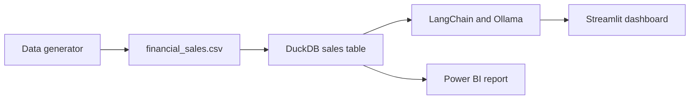

# GenAI SQL Analytics and Financial Reporting

An end-to-end Generative BI application for exploring financial sales data with natural language. The project combines synthetic data generation, DuckDB analytics, LangChain text-to-SQL, Ollama, and a multi-tab Streamlit dashboard.

## Project Overview

The dashboard provides:

- KPI tracking for revenue, profit margin, operating cost, and transactions.
- Region and department filters.
- Revenue and monthly financial performance visualizations.
- Natural-language questions converted into DuckDB SQL.
- CFO-style executive narrative generation.
- Statistical anomaly detection using revenue and z-scores.
- A Power BI workbook in `dashboard/` for executive reporting.

## Technology Stack

| Area | Technology |
| --- | --- |
| Application | Python, Streamlit |
| LLM integration | LangChain, Ollama |
| Default local model | `qwen2.5:1.5b` |
| Database | DuckDB |
| Data processing | Pandas, NumPy, SciPy |
| Visualization | Plotly |
| BI workbook | Power BI (`.pbix`) |

## Repository Structure

```text
.
├── data/
│   ├── financial_sales.csv       # Generated sales data
│   └── generate_data.py          # Synthetic data generator
├── dashboard/
│   └── financial_kpis.pbix       # Power BI report
├── src/
│   ├── app.py                    # Streamlit dashboard
│   ├── database.py               # DuckDB connection and schema helpers
│   ├── narrator.py               # CFO narrative generation
│   └── pipeline.py               # Natural language to SQL pipeline
├── requirements.txt
└── README.md
```

## Prerequisites

- Python 3.10 or newer
- Ollama installed and running
- Enough memory for the selected local model

The default model is intentionally small for machines with approximately 6-8 GB RAM. Larger models such as `llama3` may fail to load on low-memory systems.

## Installation

From the project root on Windows:

```bat
python -m venv venv
venv\Scripts\activate
pip install -r requirements.txt
```

Install the default Ollama model:

```bat
ollama pull qwen2.5:1.5b
```

## Generate or Refresh Data

The repository includes a generated CSV. To recreate it with 2,500 records and injected anomalies:

```bat
venv\Scripts\python.exe data\generate_data.py
```

The Streamlit dashboard loads the CSV into a private in-memory DuckDB connection when it starts, so multiple browser sessions do not compete for a file lock. `finance_analytics.db` remains available for separate local reporting or inspection workflows.

## Run the Dashboard

```bat
venv\Scripts\activate
streamlit run src\app.py
```

Streamlit will display the local URL in the terminal, normally `http://localhost:8501`.

## Configure the Ollama Model

The application reads the model name from `OLLAMA_MODEL`. If it is not set, it uses `qwen2.5:1.5b`.

For Command Prompt:

```bat
set OLLAMA_MODEL=qwen2.5:1.5b
streamlit run src\app.py
```

For PowerShell:

```powershell
$env:OLLAMA_MODEL = "qwen2.5:1.5b"
streamlit run src\app.py
```

Any model specified here must already be installed with `ollama pull <model-name>`.

## Example Questions

Try these in the Text-to-SQL workspace:

- `What are the top 3 regions by net revenue and total profit margin?`
- `Which product generated the most revenue?`
- `Show operating cost by department.`
- `What is the monthly net revenue trend?`

## Data Flow



## GitHub Setup

Create an empty repository on GitHub, then run these commands from the project root:

```bat
git init
git branch -M main
git add .
git commit -m "feat: add GenAI SQL analytics dashboard"
git remote add origin https://github.com/YOUR_USERNAME/YOUR_REPOSITORY.git
git push -u origin main
```

Replace `YOUR_USERNAME` and `YOUR_REPOSITORY` with the actual GitHub values. The `.gitignore` excludes the virtual environment, local DuckDB files, environment files, Python cache files, and generated CSV data.

## Deployment Checklist

Before deploying, complete the following:

1. Host the Streamlit app on Streamlit Community Cloud, Render, or another Python-compatible service.
2. Publish `dashboard/financial_kpis.pbix` to the Power BI Service.
3. Configure scheduled data generation and Power BI refresh if the dataset becomes dynamic.
4. Store Ollama or hosted model configuration in deployment environment variables.
5. Add SQL validation that permits only read-only `SELECT` statements before exposing text-to-SQL publicly.
6. Add authentication and rate limiting before allowing external users to access the dashboard.

## Production Hardening

The current project is designed as a local demonstration. For production use, add:

- Read-only database credentials and an explicit SQL statement allowlist.
- Validation for generated SQL before execution.
- Prompt and input limits to reduce misuse and resource exhaustion.
- Automated tests for generated SQL, database queries, and dashboard startup.
- Monitoring for model failures, query latency, and anomalous outputs.

## Portfolio Assets

For a portfolio presentation, add screenshots or a short recording of:

- The KPI dashboard and filters.
- A natural-language question and its generated SQL.
- The CFO briefing output.
- The anomaly radar and Power BI report.

## Developer

- **Developer:** Devvrat Welekar
- **GitHub:** [github.com/devvratwelekar](https://github.com/devvratwelekar)
- **LinkedIn:** [Devvrat Welekar Profile](https://www.linkedin.com/in/devvrat-welekar/)